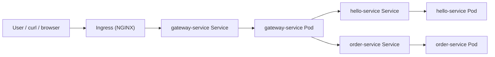

# Kubernetes Microservices Demo

This folder contains a minimal Kubernetes deployment demo that is easy to explain in interviews.

It uses three small Flask-based microservices:

- `gateway-service`: the public entry point
- `hello-service`: a simple downstream service
- `order-service`: another downstream service

The design intentionally mirrors a production-style setup:

- containerized services with separate Dockerfiles
- Kubernetes `Deployment` + `Service` per microservice
- `Ingress` as the external entry point
- `HorizontalPodAutoscaler` based on CPU
- `readinessProbe` and `livenessProbe`
- `RollingUpdate` strategy for zero-downtime style deployments

## Demo Architecture



## Repository Layout

```text
k8s-microservices-demo/
  services/
    gateway-service/
    hello-service/
    order-service/
  k8s/
    00-namespace.yaml
    01-configmap.yaml
    10-hello.yaml
    20-order.yaml
    30-gateway.yaml
    40-ingress.yaml
```

## Service Endpoints

### gateway-service

- `GET /health/live`
- `GET /health/ready`
- `GET /api/hello`
- `GET /api/orders/<order_id>`
- `GET /api/demo/<order_id>`

### hello-service

- `GET /health/live`
- `GET /health/ready`
- `GET /hello`

### order-service

- `GET /health/live`
- `GET /health/ready`
- `GET /orders/<order_id>`

## How to Run on macOS with Docker Desktop Kubernetes

This is the fastest path if you already use Docker Desktop on macOS.

### 1. Start Docker Desktop and enable Kubernetes

Open Docker Desktop, then enable:

- `Settings -> Kubernetes -> Enable Kubernetes`

Wait until this command reports `running`:

```bash
docker desktop kubernetes status
kubectl config current-context
kubectl get nodes
```

Expected context:

```text
docker-desktop
```

### 2. Build the images locally

```bash
cd /Users/a0000/Desktop/invoice-automation-system-supply-chain/k8s-microservices-demo/services/hello-service
docker build -t demo/hello-service:v1 .

cd /Users/a0000/Desktop/invoice-automation-system-supply-chain/k8s-microservices-demo/services/order-service
docker build -t demo/order-service:v1 .

cd /Users/a0000/Desktop/invoice-automation-system-supply-chain/k8s-microservices-demo/services/gateway-service
docker build -t demo/gateway-service:v1 .
```

### 3. Install the NGINX ingress controller

Docker Desktop provides a local Kubernetes cluster, but it does not install the ingress controller by default.

```bash
kubectl apply -f https://raw.githubusercontent.com/kubernetes/ingress-nginx/controller-v1.14.3/deploy/static/provider/cloud/deploy.yaml
kubectl rollout status deployment/ingress-nginx-controller -n ingress-nginx --timeout=180s
kubectl get svc -n ingress-nginx ingress-nginx-controller -o wide
```

Expected output shape:

```text
EXTERNAL-IP   localhost
```

### 4. Apply the demo manifests

```bash
cd /Users/a0000/Desktop/invoice-automation-system-supply-chain/k8s-microservices-demo
kubectl apply -f k8s/
kubectl get deployment,svc,ingress,hpa -n demo-microservices
kubectl get pods -n demo-microservices
```

### 5. Call the gateway through Ingress

The simplest test is to override DNS resolution in curl:

```bash
curl --resolve micro.demo.local:80:127.0.0.1 http://micro.demo.local/api/demo/1001
```

If you prefer browser access, add this entry to `/etc/hosts`:

```text
127.0.0.1 micro.demo.local
```

Then open:

```text
http://micro.demo.local/api/demo/1001
```

## How to Run on macOS with Minikube

### 1. Start Minikube and enable required addons

```bash
minikube start
minikube addons enable ingress
minikube addons enable metrics-server
eval "$(minikube docker-env)"
```

### 2. Build the container images inside the Minikube Docker daemon

```bash
cd /Users/a0000/Desktop/invoice-automation-system-supply-chain/k8s-microservices-demo/services/hello-service
docker build -t demo/hello-service:v1 .

cd /Users/a0000/Desktop/invoice-automation-system-supply-chain/k8s-microservices-demo/services/order-service
docker build -t demo/order-service:v1 .

cd /Users/a0000/Desktop/invoice-automation-system-supply-chain/k8s-microservices-demo/services/gateway-service
docker build -t demo/gateway-service:v1 .
```

### 3. Apply the Kubernetes manifests

```bash
cd /Users/a0000/Desktop/invoice-automation-system-supply-chain/k8s-microservices-demo
kubectl apply -f k8s/
kubectl get pods -n demo-microservices
kubectl get svc -n demo-microservices
kubectl get ingress -n demo-microservices
kubectl get hpa -n demo-microservices
```

### 4. Add a host entry for the Ingress hostname

Get the Minikube IP:

```bash
minikube ip
```

Then add an entry like this to `/etc/hosts`:

```text
<MINIKUBE_IP> micro.demo.local
```

### 5. Send a test request

```bash
curl http://micro.demo.local/api/demo/1001
```

Expected response shape:

```json
{
  "service": "gateway-service",
  "version": "v1",
  "requestPath": "ingress -> gateway-service -> hello-service/order-service",
  "hello": {
    "service": "hello-service",
    "version": "v1",
    "message": "Hello from the Kubernetes demo."
  },
  "order": {
    "service": "order-service",
    "version": "v1",
    "orderId": "1001",
    "status": "PROCESSING",
    "items": [
      { "sku": "SKU-100", "quantity": 2 },
      { "sku": "SKU-200", "quantity": 1 }
    ]
  }
}
```

## How to Demonstrate a Rolling Update

Build a new image version for one service, for example the gateway:

```bash
cd /Users/a0000/Desktop/invoice-automation-system-supply-chain/k8s-microservices-demo/services/gateway-service
docker build -t demo/gateway-service:v2 .
```

Update the deployment image:

```bash
kubectl set image deployment/gateway-service gateway-service=demo/gateway-service:v2 -n demo-microservices
kubectl rollout status deployment/gateway-service -n demo-microservices
```

Why this is near zero-downtime:

- the deployment uses `maxUnavailable: 0`
- Kubernetes creates a new Pod before removing an old one
- traffic only goes to Pods that pass the readiness probe
- the old Pods stay in service until the new Pods are ready

## How to Demonstrate HPA

You can generate simple load against the gateway:

```bash
kubectl run load-generator --rm -it --restart=Never --image=busybox:1.36 -n demo-microservices -- \
  sh -c 'while true; do wget -q -O- http://gateway-service/api/demo/1001 > /dev/null; done'
```

In another terminal:

```bash
kubectl get hpa -n demo-microservices -w
kubectl get pods -n demo-microservices -w
```

## What Each Kubernetes Component Does

### Pod

A Pod is the smallest deployable unit in Kubernetes.  
In this demo, each Pod runs one container, such as one `gateway-service` instance.

### Deployment

A Deployment manages a desired number of Pod replicas.  
It handles rolling updates, self-healing, and restarts when Pods fail.

### Service

A Service gives a stable network identity to a set of Pods.  
Even if Pods are recreated, the Service name stays the same.

### HPA

The HorizontalPodAutoscaler watches metrics such as CPU utilization and automatically scales the number of Pods up or down.

## End-to-End Request Flow

1. A user sends `GET /api/demo/1001` to `micro.demo.local`.
2. The request first reaches the Kubernetes `Ingress`.
3. The `Ingress` routes the request to `gateway-service`.
4. The `gateway-service` `Service` load-balances to one ready `gateway-service` Pod.
5. The gateway Pod makes internal HTTP calls to:
   - `hello-service`
   - `order-service`
6. Each downstream request goes through that service's stable ClusterIP `Service`.
7. Kubernetes forwards those requests to healthy, ready Pods behind each service.
8. The gateway aggregates the responses and returns the final JSON to the user.

## Why Rolling Update Can Achieve Zero Downtime

Rolling update does not replace every Pod at once.  
Instead, Kubernetes gradually creates new Pods and removes old ones in batches.

In this demo:

- `maxUnavailable: 0` means old Pods are not taken down before replacements exist
- `maxSurge: 1` allows one extra Pod during the rollout
- `readinessProbe` ensures traffic only reaches healthy new Pods

That combination keeps at least the old ready Pods serving traffic while the new version starts.

## Readiness vs Liveness

### Readiness probe

Readiness answers: "Can this Pod receive traffic right now?"

If readiness fails:

- the Pod keeps running
- Kubernetes removes it from the Service endpoints
- traffic is not routed to it until readiness passes again

### Liveness probe

Liveness answers: "Is this container still alive, or is it stuck?"

If liveness fails:

- Kubernetes restarts the container

## How HPA Works

The HPA controller periodically reads CPU or memory metrics from the metrics API.  
It compares actual utilization with the target defined in the HPA.

For example:

- target CPU utilization = 70%
- current average CPU utilization = 90%

Kubernetes calculates that more replicas are needed and scales the Deployment up.

When the load drops, it scales back down, while staying within:

- `minReplicas`
- `maxReplicas`

## What Happens If a Pod Fails to Start

If a Pod fails during startup:

- Kubernetes keeps trying to start the container
- the Pod may go into `CrashLoopBackOff` if failures repeat
- the Deployment still tries to maintain the desired replica count
- if other healthy replicas exist, the Service continues routing traffic to them

This is one reason multiple replicas matter.

## What Happens If Readiness Probe Fails

If readiness fails:

- the Pod is considered not ready
- Kubernetes removes it from the Service endpoint list
- the Pod is not sent production traffic
- once readiness starts passing again, the Pod is added back

This is useful during warm-up, dependency recovery, or temporary downstream issues.

## Common Interview Questions and Standard Answers

### Q1. What is the difference between a Deployment and a Pod?

**Answer:**  
A Pod is a running instance of a container. A Deployment is a higher-level controller that manages Pods, keeps the desired number running, and supports rolling updates and self-healing.

### Q2. Why do we need a Service if Pods already have IP addresses?

**Answer:**  
Pod IPs are ephemeral. When Pods restart, their IPs change. A Service provides a stable DNS name and virtual IP so clients can reach the application consistently.

### Q3. Why is readiness important for zero-downtime deployment?

**Answer:**  
Because a Pod can be running but not yet able to serve traffic. Readiness prevents Kubernetes from sending requests to the new Pod until it has finished startup and is actually ready.

### Q4. How does Kubernetes decide when to scale with HPA?

**Answer:**  
The HPA compares observed metrics such as average CPU utilization against a target value. If actual usage is above target, it scales out. If usage is below target, it scales in, within configured min and max bounds.

### Q5. What happens during a rolling update?

**Answer:**  
Kubernetes gradually creates Pods with the new version and removes old Pods in controlled batches, according to `maxSurge` and `maxUnavailable`. This reduces risk and allows traffic to continue flowing.

### Q6. What happens if a Pod passes liveness but fails readiness?

**Answer:**  
The container is still alive, so Kubernetes does not restart it. But because it is not ready, it is removed from the Service endpoints and does not receive traffic.

### Q7. Why did you set more than one replica?

**Answer:**  
Multiple replicas improve availability, make rolling updates safer, and allow HPA to scale horizontally under load.

### Q8. How would you describe the request path in this demo?

**Answer:**  
External traffic enters through the Ingress, gets routed to the gateway-service, and then the gateway makes internal service-to-service calls to the hello-service and order-service through their ClusterIP services.

## Interview Summary

You can summarize this demo in one short paragraph:

> I deployed three containerized Flask microservices on Kubernetes using Deployments, Services, Ingress, and HPAs. I configured rolling updates with readiness and liveness probes so new Pods only received traffic after they were healthy, which is the key mechanism behind zero-downtime style deployment. The gateway-service acted as the public entry point and called downstream services internally, which made the request path easy to explain end to end.
